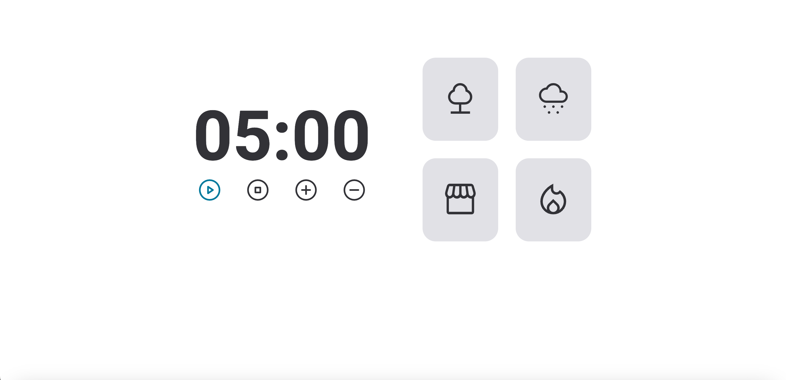

<h1 align="center"> Projeto - Focus Timer v02</h1>

Hora de colocar em prática o que foi ensinado no stage 05 e o que foi visto nos stages anteriores.

  <a href="#-tecnologias">Tecnologias</a>&nbsp;&nbsp;&nbsp;|&nbsp;&nbsp;&nbsp;
  <a href="#-projeto">Projeto</a>&nbsp;&nbsp;&nbsp;|&nbsp;&nbsp;&nbsp;
  <a href="#-layout">Layout</a>&nbsp;&nbsp;&nbsp;|&nbsp;&nbsp;&nbsp;

  

 

## 🚀 Tecnologias

Esse projeto foi desenvolvido com as seguintes tecnologias:

&nbsp;
&nbsp;
&nbsp;

## 💻 Projeto

Neste projeto estudei sobre: Como manipular o navegador utilizando a DOM, funções callbacks, recursividade, princípios do Clean Code, ES6 Modules, padrão Factory, injeção de dependências, refatoração de código e muito mais... como estudo, foi criado o projeto de um timer com alteração de tema dark e light e também aplicação de efeitos sonoros.

## 🔖 Layout do projeto

 
 

Link do Figma:
 
https://efficient-sloth-d85.notion.site/FocusTimer-Vers-o-2-0-2e273fa9212a432eae6b51dda3c69594

 

## Aprendizado

- Estrutura de dados HTML
- CSS
- Funções no Javascript
- Manipulação da DOM
- Funções _callback_
- Recursividade
- Clean Code
- ES6 Modules
- Padrão Factory
- Refatoração
- Injeção de Dependências

 
 

🚀 by Paulo Henrique A. Stabelino.
